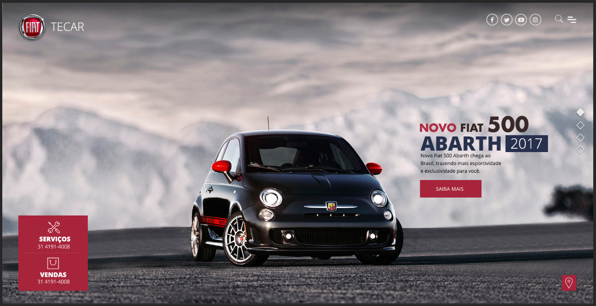
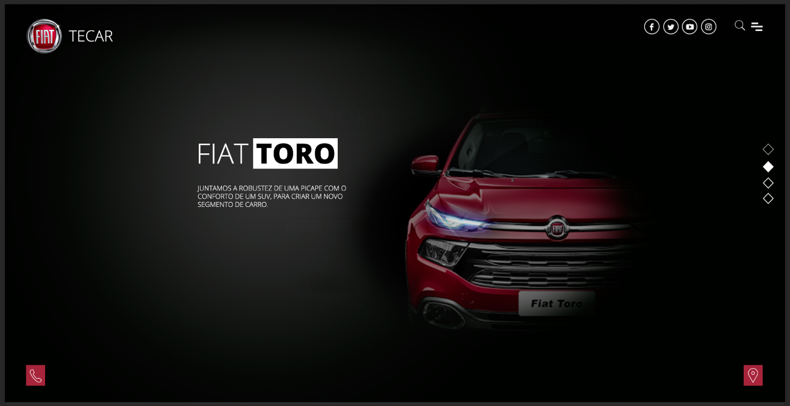
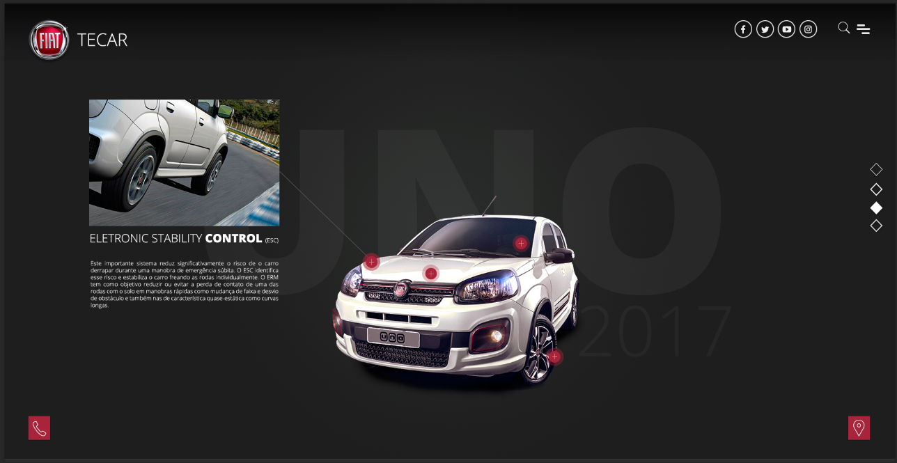

## Car Dealership

This project is an interactive web application for a car dealership, designed to provide an engaging and unique user experience. Utilizing the powerful GSAP (GreenSock Animation Platform) library, our goal is to elevate the user experience to a new level.

###  layout

Build with photoshop

### Key Features:

- Animated Menu: We've crafted an animated navigation menu that not only guides users but also adds an element of delight to the browsing experience. Smooth transitions and eye-catching animations make navigation a breeze.

- Full-Screen Interactive Map: Explore our cars and dealership locations with a full-screen interactive map. This dynamic map expands to fill the screen, providing users with an immersive and informative experience. GSAP ensures seamless transitions and interactions.

- Contact Phone Interaction: Engage with our contact details effortlessly. Clicking on the contact phone number triggers an intuitive interaction, making it easy for users to get in touch with us instantly.

### Technologies Used:

- HTML5, CSS3, JavaScript
- GSAP (GreenSock Animation Platform)
- Bootstrap for the basic structure
- Pixeden stroke 7 icons

### TODO:

- [x] Add on github
- [x] Upload to server
- [ ] Migrate Google maps to any public map
- [ ] create micro interaction on 3th slide

